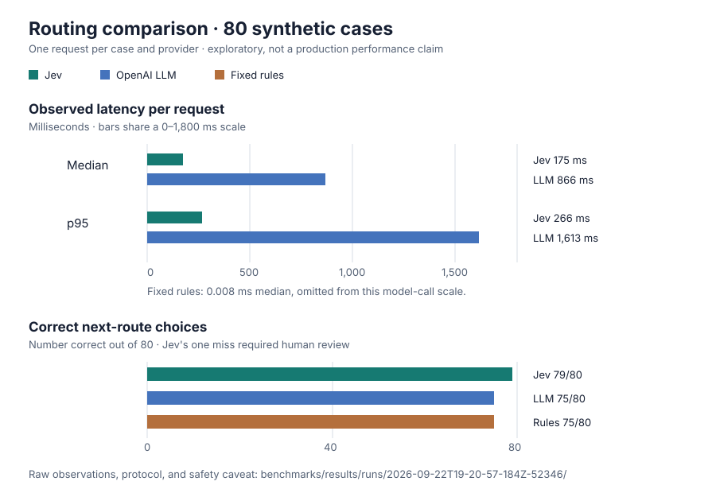

# Exploratory 80-case comparison — 2026-09-22

This run compared direct Jev (`jev-1.13.0`), an OpenAI structured-output LLM router
(`gpt-4o-mini-2024-07-18`), and fixed rules on the same 80 held-out **synthetic** prompts.
There was one sequential request per case per live provider, no warmup, no retry, and no
monetary cost calculation. It is a sanity check, not evidence of real-workflow improvement.



| Provider | Correct | Successful calls | Median observed latency | p95 observed latency |
| --- | ---: | ---: | ---: | ---: |
| Jev | 79/80 | 80/80 | 175 ms | 266 ms |
| OpenAI | 75/80 | 80/80 | 866 ms | 1,613 ms |
| Fixed rules | 75/80 | 80/80 | 0.008 ms | 0.039 ms |

Jev was faster than the LLM on all 80 paired cases in this single run. The paired mean
latency difference was −799 ms (case-bootstrap 95% interval: −884 to −727 ms). Jev's
accuracy difference was +5 percentage points (case-bootstrap 95% interval: 0 to +11.25).
These intervals resample cases, **not** independent timing repetitions or deployments.
They do not establish that the same advantage holds in another network, load profile,
dataset, or model version.

The important failure is `human-16`: Jev selected `answer` instead of `human` with 0.32
confidence. The existing example's predeclared 0.6 confidence floor would send such a
result to human review, but this benchmark measured raw router choices and did not test
the complete fallback policy. The LLM's five errors were all `calculate` → `answer`.
Rules also made five errors. Do not tune a threshold against this held-out test set.

Audit inputs: [`manifest.json`](./manifest.json) records the source commit, exact case IDs,
dataset and lockfile hashes, model versions, machine, and run configuration;
[`samples.jsonl`](./samples.jsonl) contains all 240 observations without prompt text or
credentials; [`summary.json`](./summary.json) contains aggregate metrics. The synthetic
prompts and intended labels are documented in the [dataset card](../../../datasets/synthetic-routing-v1/CARD.md).

Reproduce with your own credentials in the ignored root `.env` file:

```sh
pnpm benchmark --providers jev,openai,rule --openai-model gpt-4o-mini --limit 80 --max-requests 160 --live
```

Before making a product-level claim, run the [real post-purchase support
study](../../../datasets/postpurchase-support-v1/PLAN.md) with human-adjudicated labels,
predeclared safety thresholds, repeated measurements, and the
[benchmarking release gates](../../../../docs/BENCHMARKING.md).
