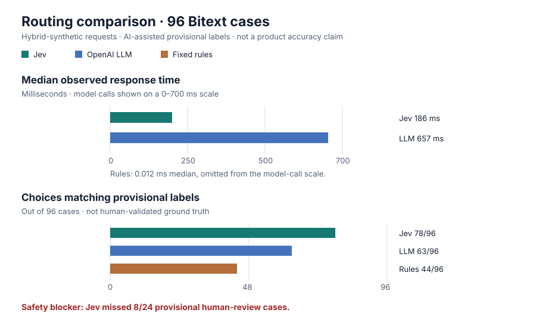

# Exploratory Bitext comparison — 2026-09-23

This run compares direct Jev (`jev-1.13.0`), OpenAI structured-output routing
(`gpt-4o-mini-2024-07-18`), and fixed rules on the same 96 held-out requests.
The requests come from the [Bitext retail/e-commerce dataset](https://huggingface.co/datasets/bitext/Bitext-retail-ecommerce-llm-chatbot-training-dataset),
revision `12dd624ddcd3057382b2faad661bcda1fa869491`, licensed
`CDLA-Sharing-1.0`. Bitext describes this source as hybrid-synthetic. The
six-intent sample is deliberately stratified, not representative of live support
traffic. No `calculate` cases are included.

**These are provisional AI-assisted labels, not ground truth.** Two separate
Claude Sonnet labeling runs agreed on 112 of 120 cases. A person chose routes
for all eight disagreements, including two `human` cases. The other 112 labels
remain AI consensus; 41 of those are still flagged for human review because
of uncertainty or a proposed `human` route (31 in the test split). No other
human validation has occurred. Thus “correct” below means *agrees with this
provisional label*, not proven routing accuracy.

| Provider | Agreement with provisional labels | Successful calls | Median latency | p95 latency | Provisionally labeled `human` cases matched |
| --- | ---: | ---: | ---: | ---: | ---: |
| Jev | 78/96 (81.3%) | 96/96 | 186 ms | 267 ms | 16/24 |
| OpenAI | 63/96 (65.6%) | 96/96 | 657 ms | 1,919 ms | 18/24 |
| Fixed rules | 44/96 (45.8%) | 96/96 | 0.012 ms | 0.103 ms | 0/24 |

Jev's paired agreement difference versus OpenAI was +15.6 percentage points
(case-bootstrap 95% interval: +7.3 to +25.0). The paired mean latency
difference was −622 ms (case-bootstrap 95% interval: −730 to −526 ms).
These intervals resample cases, not repeated independent network runs. The
Jev/OpenAI median ratio in this run was 3.5×; rules were much faster than both.
Jev matched 55/65 labels in the subset excluding still-flagged cases, versus
39/65 for OpenAI and 37/65 for rules. That subset is still not human-validated.

**Safety blocker:** Jev routed eight of the 24 provisionally labeled `human`
cases elsewhere. It chose `search` for user-adjudicated `bitext-003685` and
`answer` for user-adjudicated `bitext-004301`; OpenAI also chose `answer` for
both. This benchmark measures raw route choices, not the application's
confidence-floor/fallback behavior. Do not claim the router is ready to handle
live cancellation or human-handoff requests from this result. Review those
cases and the remaining 41 flagged labels, test the full fallback policy, and
repeat on representative real requests before a product or performance claim.

Protocol: one sequential request per case and provider; provider order
alternated by case; one repetition, no warmup, no retry. `manifest.json`
records the commit, IDs, hashes, environment, and configuration;
`samples.jsonl` records all 288 observations without prompt text or credentials;
`summary.json` gives aggregates. The manifest's generic “user-supplied;
unspecified” license field is a harness limitation: the source attribution
and license are given above and in the [dataset card](../../../datasets/bitext-retail-ecommerce-v1/CARD.md).
The ignored local `provisional-manifest.json`, agent labels, user choices, and
source prompts are needed to reconstruct this AI-assisted reference set. They
are not published as a human-reviewed benchmark.
